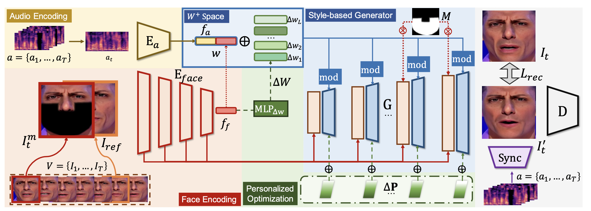

# StyleSync: High-Fidelity Generalized and Personalized Lip Sync in Style-based Generator (CVPR 2023)
Jiazhi Guan*, Zhanwang Zhang*, [Hang Zhou](https://hangz-nju-cuhk.github.io/)†, [Tianshu Hu](https://scholar.google.com/citations?user=BIixVT0AAAAJ)†, [Kaisiyuan Wang](https://scholar.google.com/citations?user=2Pedf3EAAAAJ), [Dongliang He](https://scholar.google.com/citations?user=ui6DYGoAAAAJ), Haocheng Feng, [Jingtuo Liu](https://scholar.google.com/citations?user=tVV3jmcAAAAJ), [Errui Ding](https://scholar.google.com/citations?user=1wzEtxcAAAAJ), [Ziwei Liu](https://liuziwei7.github.io/), [Jingdong Wang](https://jingdongwang2017.github.io/)

### [Project](https://hangz-nju-cuhk.github.io/projects/StyleSync) | [Paper](https://arxiv.org/abs/2104.11116) | [Demo](https://www.youtube.com/watch?v=yAPDl2dVonY)



We propose **StyleSync**, an effective framework that enables high-fidelity lip synchronization. We identify that a style-based generator would sufficiently enable such a charming property on both one-shot and few-shot scenarios.

## Code

Coming soom.

## Citation

```
@inproceedings{guan2023stylesync,
  title = {StyleSync: High-Fidelity Generalized and Personalized Lip Sync in Style-based Generator},
  author = {Guan, Jiazhi and Zhang, Zhanwang and Zhou, Hang and HU, Tianshu and Wang, Kaisiyuan and He, Dongliang and Feng, Haocheng and Liu, Jingtuo and Ding, Errui and Liu, Ziwei and Wang, Jingdong},
  booktitle = {Proceedings of the IEEE/CVF Conference on Computer Vision and Pattern Recognition (CVPR)},
  year = {2023}
}
```
